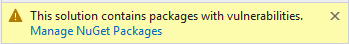
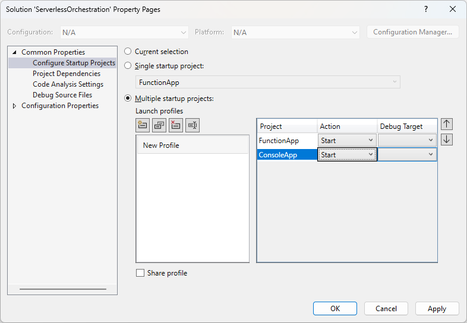

[Serverless Orchestration Demo](README.md) \

# Initialize Solution

In this first lab, we will initialize the solution that will be used throughout the **Azure Durable Functions for Serverless .NET Orchestration** demo.

## Step 1: Initialize the Solution

1. Open Visual Studio and create a new project.
2. On the *Create a new project* dialog, search for and select the **Blank Solution** project template; click the **Next** button.
3. On the *Configure your new project* dialog, name the solution `ServerlessOrchestration` and select the appropriate location.; click the **Create** button.

## Step 2: Create the Durable Function App

1. Add the Durable Function App to the solution.

   1. Right-click the `ServerlessOrchestration` solution and click the **Add** > **New Project** menu option.

   2. In the *Add a new project* dialog, select **Azure Functions** as the project template; click the **Next** button.

   3. In the *Configure your new project* dialog, name the project `FunctionApp` and select the appropriate location.

   4. In the *Additional Information* dialog, set the **Functions worker** to `.NET 8.0 Isolated (Long Term Supported)` and select the `Durable Functions Orchestration` **Function** type. Ensure that the **Use Azurite for runtime storage account (AzureWebJobsStorage)** is checked.

   5. Click the **Create** button.

      > [!Caution]
      >
      > Sometimes, the project templates get outdated and contain NuGet packages that have vulnerabilities. If you see a warning like the one below; build the solution (**Crtl**+**Shift**+**B**). If the warning does not go away, update any package that contains vulnerabilities - this doesn't impact performance, but a best practice is to use packages that do not contain known vulnerabilities.
      >
      > 

2. Add the **Azure.Identity** NuGet package to the project. This will allow the application to authenticate into Azure services.

   ```powershell
   Install-Package Azure.Identity
   ```

3. Delete the default `Function1.cs` file.

4. Change the port the function app will use locally.

   1. Right-click the `FunctionApp` project and click the **Properties** menu option.

   2. In the left-hand menu, click the **Debug** menu option.

   3. Click the **Open debug launch profile UI** link.

   4. Change the **Command line arguments** to

      ```
      --port 7101
      ```

   5. Close the **Launch Profiles** dialog.

5. Add the following values to the `local.settings.json` file in the **FunctionApp** project:

   ```json
   "Environment": "local"
   ```

6. Update the route prefix by adding the `routePrefix` node to the `host.json`. Your `host.json` file should look like this after the change:

   ```json
   {
     "version": "2.0",
     "logging": {
       "applicationInsights": {
         "samplingSettings": {
           "isEnabled": true,
           "excludedTypes": "Request"
         },
         "enableLiveMetricsFilters": true
       }
     },
     "extensions": {
       "http": {
         "routePrefix": "orchestrations"
       }
     }
   }
   ```

   > By default, Azure Function App projects do not include the `routePrefix` declaration. If nothing is specified, the default route prefix will be `api`.

## Step 3: Create the Console App

1. Add the Console App to the solution.

   1. Right-click the `ServerlessOrchestration` solution and click the **Add** > **New Project** menu option.
   2. In the *Add a new project dialog*, select **Console App** as the project template; click the **Next** button.
   3. In the *Configure your new project* dialog, name the project `ConsoleApp` and select the appropriate location; click the **Next** button.
   4. In the *Additional Information* dialog, set the **Framework** to `.NET 8. (Long Term Support)`.
   5. Click the **Create** button.

2. Add the **Spectre.Console** NuGet package to the project. This will allow us to have a nicer console output.

   ```powershell
   Install-Package Spectre.Console
   ```

   > [!TIP]
   >
   > If using the **Package Manager Console**, be sure to change the **Default project** to `ConsoleApp`.

3. Replace the default code in `Prtogram.cs` with the following:

   ```C#
   using Spectre.Console;
   
   AnsiConsole.Write(new FigletText("Serverless Orchestration").Centered().Color(Color.Green));
   
   Console.WriteLine("Press any key to exit...");
   Console.ReadKey(true);
   ```

4. Add the Durable Function response types to the Console App.

   1. Add a folder to the **ConsoleApp** project named `Responses`.

   2. Add a class to the `Responses` folder named `DurableOrchestrationStartedResponse.cs`. Replace the default code with the following:

      ```c#
      using System.Text.Json.Serialization;
      
      namespace ConsoleApp.Responses;
      
      public class DurableOrchestrationStartedResponse
      {
      
      	[JsonPropertyName("id")]
      
      	public required string Id { get; set; }
      
      	[JsonPropertyName("sendEventPostUri")]
      	public required string SendEventPostUri { get; set; }
      
      	[JsonPropertyName("statusQueryGetUri")]
      	public required string StatusQueryGetUri { get; set; }
      
      	[JsonPropertyName("terminatePostUri")]
      	public required string TerminatePostUri { get; set; }
      
      	[JsonPropertyName("suspendPostUri")]
      	public required string SuspendPostUri { get; set; }
      
      	[JsonPropertyName("resumePostUri")]
      	public required string ResumePostUri { get; set; }
      
      }
      ```

   3. Add a class to the `Responses` folder named `DurableOrchetrationStatusResponse.cs`. Replace the default code with the following:

      ```c#
      using System.Text.Json.Serialization;
      
      namespace ConsoleApp.Responses;
      
      public class DurableOrchestrationStatusReponse
      {
      	[JsonPropertyName("name")]
      	public required string Name { get; set; }
      
      	[JsonPropertyName("instanceId")]
      	public required string InstanceId { get; set; }
      
      	[JsonPropertyName("runtimeStatus")]
      	public required string RuntimeStatus { get; set; }
      
      	[JsonPropertyName("input")]
      	public object? Input { get; set; }
      
      	[JsonPropertyName("customStatus")]
      	public object? CustomStatus { get; set; }
      
      	[JsonPropertyName("output")]
      	public object? Output { get; set; }
      
      	[JsonPropertyName("createdTime")]
      	public DateTime CreatedTime { get; set; }
      
      	[JsonPropertyName("lastUpdatedTime")]
      	public DateTime LastUpdatedTime { get; set; }
      
      }
      ```

5. Update the `Program.cs` file with the following code:

   ```C#
   using ConsoleApp.Responses;
   using Spectre.Console;
   using System.Text;
   using System.Text.Json;
   
   using HttpClient _httpClient = new();
   string _functionAppUrl = "http://localhost:7071/orchestrations/";
   int _waitTimeInSeconds = 2;
   
   string demoSelection = string.Empty;
   do
   {
   
   	Console.Clear();
   
   	AnsiConsole.Write(new FigletText("Serverless Orchestration").Centered().Color(Color.Green));
   
   	demoSelection = AnsiConsole.Prompt(
   		new SelectionPrompt<string>()
   			.Title("Which demo do you want to run?")
   			.PageSize(10)
   			.MoreChoicesText("[grey](Move up and down to reveal more demos)[/]")
   			.AddChoices([
   				"Function Chaining",
   			"Fan-Out/Fan-In",
   			"Async HTTP APIs",
   			"Monitoring",
   			"Human Interaction",
   			"Aggregator (Stateful Entities)",
   			"Exit Demo App"]
   			));
   
   	switch (demoSelection)
   	{
   		case "Function Chaining":
   			await ExecuteFunctionChainingDemo();
   			break;
   		case "Fan-Out/Fan-In":
   			await ExecuteFanOutFanInDemo();
   			break;
   		case "Async HTTP APIs":
   			await ExecuteAsyncHttpApisDemo();
   			break;
   		case "Monitoring":
   			await ExecuteMonitoringDemo();
   			break;
   		case "Human Interaction":
   			await ExecuteHumanInteractionDemo();
   			break;
   		case "Aggregator (Stateful Entities)":
   			await ExecuteAggregatorDemo();
   			break;
   		case "Exit Demo App":
   			break;
   		default:
   			break;
   	}
   
   	if (demoSelection != "Exit Demo App")
   	{
   		AnsiConsole.WriteLine();
   		AnsiConsole.MarkupLine("[yellow]Press any key to return to the main menu...[/]");
   		Console.ReadKey(true);
   	}
   
   } while (demoSelection != "Exit Demo App");
   
   async Task ExecuteFunctionChainingDemo()
   {
   	AnsiConsole.MarkupLine("[red]The [/][bold pink1]Function Chaining[/] [red]demo has not been implemented yet[/]");
   }
   
   async Task ExecuteFanOutFanInDemo()
   {
   	AnsiConsole.MarkupLine("[red]The [/][bold pink1]Fan-Out/Fan-In[/] [red]demo has not been implemented yet[/]");
   }
   
   async Task ExecuteAsyncHttpApisDemo()
   {
   	AnsiConsole.MarkupLine("[red]The [/][bold pink1]Async HTTP APIs[/] [red]demo has not been implemented yet[/]");
   }
   
   async Task ExecuteMonitoringDemo()
   {
   	AnsiConsole.MarkupLine("[red]The [/][bold pink1]Monitoring[/] [red]demo has not been implemented yet[/]");
   }
   
   async Task ExecuteHumanInteractionDemo()
   {
   	AnsiConsole.MarkupLine("[red]The [/][bold pink1]Human Interaction[/] [red]demo has not been implemented yet[/]");
   }
   
   async Task ExecuteAggregatorDemo()
   {
   	AnsiConsole.MarkupLine("[red]The [/][bold pink1]Aggregator (Stateful Entities)[/] [red]demo has not been implemented yet[/]");
   }
   
   async Task<Tuple<bool, object?>> ExecuteDemo(string demoName, string demoRoute, StringContent? requestBody = null)
   {
   
   	Tuple<bool, object?> result = new(false, null);
   
   	try
   	{
   
   		Table demoResulsTable = new();
   		demoResulsTable.HideHeaders();
   
   		await AnsiConsole.Live(demoResulsTable)
   			.StartAsync(async ctx =>
   			{
   				demoResulsTable.Title($"{demoName} Demo").LeftAligned();
   				ctx.Refresh();
   				demoResulsTable.AddColumn("Orchestration Status");
   				demoResulsTable.Columns[0].NoWrap();
   				ctx.Refresh();
   				demoResulsTable.AddRow("Starting the orchestration...");
   				ctx.Refresh();
   
   				Uri httpStartUri = new($"{_functionAppUrl}{demoRoute}");
   				HttpResponseMessage response = await _httpClient.PostAsync(httpStartUri, requestBody);
   				string responseBody = await response.Content.ReadAsStringAsync();
   
   				if (!string.IsNullOrEmpty(responseBody))
   				{
   					DurableOrchestrationStartedResponse? statusQueryResult = JsonSerializer.Deserialize<DurableOrchestrationStartedResponse>(responseBody);
   					if (statusQueryResult != null)
   					{
   
   						string statusQueryUri = statusQueryResult.StatusQueryGetUri;
   						demoResulsTable.AddEmptyRow();
   						demoResulsTable.AddRow(new Markup($"[green]Orchestration started.[/] [darkviolet]Orchestration ID:[/] [purple_1]{statusQueryResult.Id}[/]"));
   						ctx.Refresh();
   
   						object? output = await CheckStatusAsync(statusQueryUri, demoResulsTable, ctx);
   						demoResulsTable.AddEmptyRow();
   						demoResulsTable.AddRow(new Markup($"[green]Orchestration completed.[/]"));
   						ctx.Refresh();
   
   						result = new(true, output);
   					}
   					else
   					{
   						demoResulsTable.AddEmptyRow();
   						demoResulsTable.AddRow(new Markup("[red]Failed to start the orchestration[/]"));
   						ctx.Refresh();
   						result = new(false, null);
   					}
   				}
   				else
   				{
   					demoResulsTable.AddEmptyRow();
   					demoResulsTable.AddRow(new Markup("[red]Failed to start the orchestration[/]"));
   					ctx.Refresh();
   					result = new(false, null);
   				}
   
   			});
   
   
   		AnsiConsole.WriteLine();
   		return result;
   
   	}
   	catch (Exception ex)
   	{
   		AnsiConsole.WriteException(ex);
   		return new(false, null);
   	}
   }
   
   async Task<object?> CheckStatusAsync(string statusQueryUri, Table table, LiveDisplayContext ctx)
   {
   	while (true)
   	{
   		string response = await _httpClient.GetStringAsync(statusQueryUri);
   		DurableOrchestrationStatusReponse? status = JsonSerializer.Deserialize<DurableOrchestrationStatusReponse>(response);
   
   		if (status is null)
   		{
   			throw new Exception("Failed to get orchestration status");
   		}
   		else
   		{
   
   			if (status.RuntimeStatus == "Completed")
   				return status.Output;
   			else if (status.RuntimeStatus == "Failed" || status.RuntimeStatus == "Terminated")
   				throw new Exception("Orchestration failed or was terminated");
   
   			table.AddEmptyRow();
   			table.AddRow(new Markup($"[green]Orchestration status:[/] {status.RuntimeStatus}. [gray]Checking again in {_waitTimeInSeconds} seconds...[/]"));
   			ctx.Refresh();
   			await Task.Delay(_waitTimeInSeconds * 1000);
   
   		}
   	}
   }
   ```
   
   

## Step 4: Setup the Startup Projects

1. Right-click the `ServerlessOrchestration` solution and click the **Configure Startup Projects** menu option.

2. Select **Multiple startup projects**

3. Set both the `FunctionApp` and `ConsoleApp` to **Start**.

   

4. Click the **OK** button.
